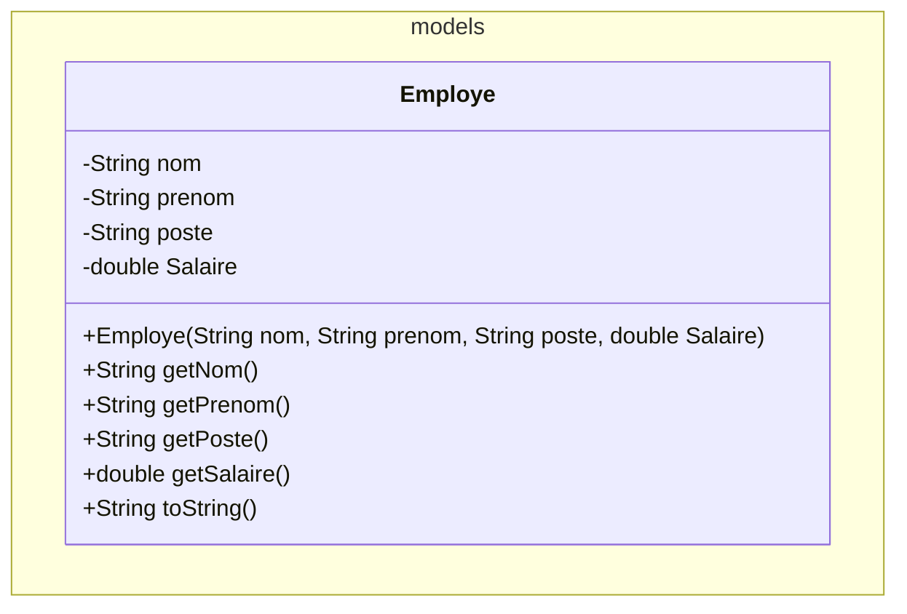

# 2023-2024 E3 Startuuup

# Contexte général
Plusieurs `Startups` gèrent ses projets et ses employés de manière très structurée pour assurer une croissance rapide et efficace. Vous devez créer un système en Java pour gérer les employés, les projets et les affectations.


## ATTENTION
Commencez par lire cette consigne `avec grande attention` et prenez garde :

- Les descriptions fonctionnelles sont précises et le choix des mots n'est pas anodin.
- Faites les points mentionnés avec précision et dans l'ordre indiqué.
- Revérifiez bien ensuite avoir fait ce qui est demandé.

# Consigne
### Employés
Dans le bon package, vous aller créer une classe permettant de modéliser un employé. Les informations utiles pour correctement définir cette classe sont données ci-dessous en UML :


Lorsqu'on affiche un employé, celui-ci doit se présenter sous la forme : "DUPONT Marie (Développeuse) [50'000.00 CHF]". (son nom de famille devra être en majusule).

### Projets
Toujours dans le package `models`, créez une classe nommée `Projet`. Un `Projet` aura plusieurs caractéristiques : son `nom`, le `budget`, la `date de fin` et une liste d'`employés`. Par exemple, un projet peut s'appeler `"Projet Alpha"`, avoir un budget de `150'000.00 CHF`, et une date de fin fixée au `31.12.2024`. Toutes ces informations doivent être fournies lors de la création du projet, sauf la liste des employés, qui pourra accueillir au maximum 5 employés. Il doit être possible de demander toutes ces informations à un projet. Le `nom`, le `budget` et la `date de fin` ne pourront pas être modifiés après coup. On doit pouvoir **ajouter** et **retirer** des employés d'un projet, et **demander la liste des employés affectés à un projet**. Lorsqu'on affiche un projet, celui-ci doit se présenter sous la forme : `"Projet Alpha, Budget: 150'000.00 CHF, Date de fin: 31 décembre 2024, Employes: [Marie Dupont, Jean Martin]"`.

Utiliser le type `LocalDate` pour la date de fin, voici un exemple de code permettant d'afficher la date au bon format : 
```
DateTimeFormatter dateFormat = DateTimeFormatter.ofPattern("PATTERN");
dateFormat.format(dateDeFin);
```

### Startup
Dans le package `models`, créez une classe nommée `Startup`. Une `Startup` aura plusieurs caractéristiques : le `nom`, une liste d'`employés` et une liste de `projets`. Par exemple, la startup peut s'appeler `"InnovateTech"`. Le `nom` de la startup doit être fourni lors de la création. Les listes d'employés et de projets seront initialement vides, avec une taille initiale à 0. 
Il doit être possible d'**ajouter** et de **retirer** des employés et des projets de la startup. On doit pouvoir **affecter un employé à un projet spécifique** de la startup, et **retirer un employé d'un projet**. (Attention, un employé qui n'est pas dans la startup ne pourra pas être affecté à un projet de la startup).
Lorsqu'on affiche une `Startup`, celui-ci se présente sour la forme suivante :
```
Startup: InnovateTech
Employes:
- DUPONT Marie (Développeuse) [50'000.00 CHF]
- MARTIN Jean (Manager) [60'000.00 CHF]
Projets:
- "Projet Alpha", Budget: 150'000.00 CHF, Date de fin: 31 décembre 2024 [Marie Dupont, Jean Martin]
- "Projet Beta", Budget: 100'000.00 CHF, Date de fin: 30 novembre 2023 [Jean Martin]
```


### Application
Dans le `main()` de la classe `Application`, vous devez effectuer plusieurs opérations.

D'abord, créez un tableau de `startups` de 10 éléments, puis remplir ce tableau avec les informations ci-dessous :

| Startup | Employés | Projets | Affectation |
| :---: | :--- | :--- | :--- |
| InnovateTech | - Employe: Marie Dupont, Poste: Développeur, Salaire: 50'000.00 CHF<br>- Employe: Jean Martin, Poste: Manager, Salaire: 60'000.00 CHF | - Projet: Projet Alpha, Budget: 150'000.00 CHF, Date de fin: 2024-12-31<br>- Projet: Projet Beta, Budget: 100000.00 CHF, Date de fin: 2023-11-30 | - Projet Alpha: Marie Dupont, Jean Martin<br>- Projet Beta : Jean Martin |
| BananaTech | - Employe: John Mackey, Poste: CIO, Salaire: 100'000.00 CHF<br>- Employe: Mireille Roduit, Poste: CEO, Salaire: 100'000.00 CHF<br>- Employe: Jeff Phyo, Poste: CFO, Salaire: 60'000.00 CHF | - Projet: Projet IA, Budget: 202'000.00 CHF, Date de fin: 2024-12-31 | - Projet IA: John Mackey, Mireille Roduit, Jeff Phyo  |

Enfin, affichez les détails de toutes les startups en utilisant la méthode `static afficherDetails(Startup startup)` ci-dessous 


### Exemple de résultat sur la console
Si vous avez correctement réalisé cette application, vous devriez obtenir un affichage ressemblant à ceci pour la première startup :
```
-----------------------------
Startup: InnovateTech
Employes:
- DUPONT Marie (Développeuse) [50'000.00 CHF]
- MARTIN Jean (Manager) [60'000.00 CHF]
Projets:
- "Projet Alpha", Budget: 150'000.00 CHF, Date de fin: 31 décembre 2024 [Marie Dupont, Jean Martin]
- "Projet Beta", Budget: 100'000.00 CHF, Date de fin: 30 novembre 2023 [Jean Martin]
La startup a 2 employés.
Le budget total des projets est de 250000.0 CHF.
-----------------------------
-----------------------------
Startup: BananaTech
Employes:
- John Mackey (CIO) [100'000.00 CHF]
- Mireille Roduit (CEO) [100'000.00 CHF]
- Jeff Phyo (CFO) [60'000.00 CHF]
Projets:
- "Projet IA", Budget: 220'000.00 CHF, Date de fin: 31 décembre 2024 [John Mackey, Mireille Roduit, Jeff Phyo]
La startup a 3 employés.
Le budget total des projets est de 220000.0 CHF.
-----------------------------
```
## Fonctionnalités supplémentaires
Une fois tout ce qui précède réalisé et fonctionnel, ajoutiez ces capacités à vos classes ´Startup´ et ´Projets´:

### Startup :
- **Calcul du résultat annuelle** : on doit pouvoir demander à la startup le résultat en CHF du coût annuel. C'est à dire la somme du salaire de la startup - la somme des projets réalisés. Le résultat peut être négatif ou positif.
- **Moyenne du salaire des employés** : on doit pouvoir demander à la startup quel est le salaire moyen des employés de la startup. On obtiendra le salaire moyen en CHF.

### Remise
Faites signe au professeur lorsque vous aurez terminé et que vous êtes prêt à rendre. Il vous autorisera à remettre le réseau. Rendez votre travail par push GitHub et quittez rapidement la salle en silence.