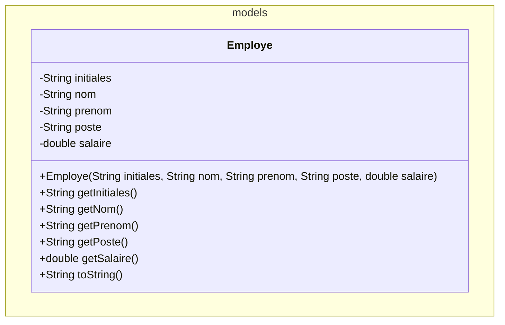
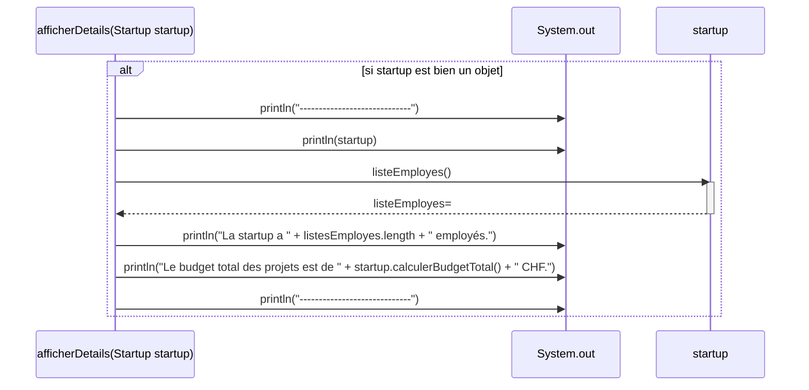

# 2023-2024 E3 Startuuup

# Contexte général
Les `Startup` gèrent leurs projets et leurs employés de manière très structurée pour assurer une croissance rapide et efficace.

Vous devez créer un logiciel en Java pour gérer des startups, leurs employés, leurs projets, leurs employées et leurs affectations sur des projets.


## ATTENTION
Commencez par lire cette consigne `avec grande attention` et prenez garde :

- Les descriptions fonctionnelles sont précises et le choix des mots n'est pas anodin.
- Faites les points mentionnés avec précision et dans l'ordre indiqué.
- Revérifiez bien avoir fait ce qui est demandé, au fur et à mesure.

# Consigne
### Employé
Dans le bon package, vous aller créer une classe permettant de modéliser un employé.

Les informations utiles pour correctement définir cette classe sont données ci-dessous en UML :

Lorsqu'on affiche un employé, celui-ci doit se présenter sous la forme : 
```
RAM / RAMALHO Mario (Manager) [60'000.00 CHF]
```
N.B. Le nom de famille est mis en majuscule, tout comme les initiales

### Projet

Toujours dans le package `models`, créez une classe nommée `Projet`.

Un `Projet` aura plusieurs caractéristiques : un `nom`, un `budget`, une `date de fin` et une liste d'`employés` de taille fixe, pouvant accueillir au maximum 5 employés. Par exemple, un projet peut s'appeler `"Projet Alpha"`, avoir un budget de `150'000.00 CHF` et une date de fin fixée au `31.12.2024`. La date peut être stocké sous forme de chaîne de caractères.

Toutes ces informations doivent être fournies lors de la création d'un nouveau projet, sauf la liste des employés car on part du principe qu'un projet fraîchement créé n'aura pas encore d'employés travaillant dessus.

Il doit être possible de demander toutes ses caractéristiques à un projet. Par contre son `nom`, son `budget` et sa `date de fin` ne pourront pas être modifiés une fois celui-ci créé.

On doit pouvoir **ajouter** et **retirer** des employés d'un projet. On doit également pouvoir **demander la liste des employés affectés à un projet**. Pour terminer, on doit pouvoir **obtenir la liste des initiales des employés sur un projet**, qui sera une chaîne du genre "RAM,FRI,RIF" avec les initiales séparées par une virgule.

Lorsqu'on affiche un projet, celui-ci doit se présenter sous la forme :
```
Projet Alpha, Budget: 150'000.00 CHF, Date de fin: 31.12.2024, Employes: [FRI,RAM]
```
N.B. Pour la liste des initiales des employés sur ce projet, pensez à utiliser votre méthode qui fait cela.

### Startup

Dans le package `models`, créez une classe nommée `Startup`.

Une `Startup` aura plusieurs caractéristiques : un `nom` (par exemple "InnovateTech"), une liste d'`employés` ainsi qu'une liste de `projets`.

Seul le `nom` de la startup devra être fourni lors de la création d'une nouvelle `Startup`, car on partira du principe que celle-ci n'aura encore aucun employé ni aucun projet.

On utilisera ici des listes sans "trous", contenant toujours exactement tous les employés et tous les projets concernés. Donc initialement, ces listes d'employés et de projets seront vides, d'une taille initiale 0.

Il doit être possible d'**ajouter** et de **retirer** des employés à une startup. De même, il doit être possible d'**ajouter** et de **retirer** des projets à une startup.

Une startup doit aussi mettre à disposition une méthode `calculerBudgetTotal()` qui déterminera le total des budgets de tous ses projets, ainsi que `listeEmployes()` qui produira la liste de tous ses employés sans trous.

Pour terminer, on doit également pouvoir **affecter un employé à un projet** de la startup, et **retirer un employé d'un projet**. (Attention, un employé qui n'est pas dans la startup ne pourra pas être affecté ou retiré d'un projet de la startup).

Lorsqu'on affichera une `Startup`, celle-ci se présentera sour la forme suivante :
```
Startup: InnovateTech
Employés:
- FRI / FRIEDLI Paul (Développeur) [50'000.00 CHF]
- RIF / RIEDO Fanny (CTO) [60'000.00 CHF]
Projets:
- "Projet Projet Alpha", Budget: 150'000.00 CHF, Date de fin: 31.12.2024 [FRI]
- "Projet Projet Beta", Budget: 100'000.00 CHF, Date de fin: 30.11.2023 [FRI,RIF]
```

### Application

Dans le `main()` de la classe `Application`, vous devez effectuer plusieurs opérations.

D'abord, créez une liste pouvant accueillir jusqu'à 10 startups.

Ensuite, remplissez ce tableau avec les informations ci-dessous :

| Startup | Employés | Projets | Affectation |
| :---: | :--- | :--- | :--- |
| **InnovateTech** | **FRIEDLI Paul**<br>Initiales: FRI, Poste: Développeur, Salaire: 50'000.00 CHF<br><br>**RIEDO Fanny**<br>Initiales: RIF, Poste: CTO, Salaire: 60'000.00 CHF | **Projet Alpha**<br>Budget: 150'000.00 CHF, Date de fin: 31.12.2024<br><br>**Projet Beta**<br>Budget: 100000.00 CHF, Date de fin: 30.11.2023 | **Projet Alpha** :<br>FRI+RIF<br><br>**Projet Beta** :<br>RIF |
| **BananaTech** | **MACKEY John**<br>Initiales: MAC, Poste: CIO, Salaire: 100'000.00 CHF<br><br>**RODUIT Mireille**<br>Initiales: ROD, Poste: CEO, Salaire: 100'000.00 CHF<br><br>**PHYO Jeff**<br>Initiales: PHY, Poste: CFO, Salaire: 60'000.00 CHF | **Projet IA**:<br>Budget: 202'000.00 CHF, Date de fin: 31.12.2024 | **Projet IA**:<br>MAC+ROD+PHY |

Enfin, affichez le détails de chacune de vos startups en utilisant la méthode `static afficherDetails(Startup startup)` qu'il va vous falloir ajouter à la classe `Application`. Son code vous est donné ci-dessous :


### Exemple de résultat sur la console

Si vous avez correctement réalisé cette application, vous devriez obtenir un affichage ressemblant à ceci pour la première startup :
```
-------------------
Startup: InnovateTech
Employés:
- FRI / FRIEDLI Paul (Développeur) [50'000.00 CHF]
- RIF / RIEDO Fanny (CTO) [60'000.00 CHF]
Projets:
- "Projet Projet Alpha", Budget: 150'000.00 CHF, Date de fin: 31.12.2024 [FRI]
- "Projet Projet Beta", Budget: 100'000.00 CHF, Date de fin: 30.11.2023 [FRI,RIF]

La startup a 2 employés.
Le budget total de la startup est de 250000.0 CHF.
-------------------
Startup: BananaTech
Employés:
- MAJ / MACKEY John (CIO) [100'000.00 CHF]
- ROM / RODUIT Mireille (CEO) [100'000.00 CHF]
- PHJ / PHYO Jeff (CFO) [60'000.00 CHF]
Projets:
- "Projet Projet IA", Budget: 220'000.00 CHF, Date de fin: 31.12.2024 [MAJ,ROM,PHJ]

La startup a 3 employés.
Le budget total de la startup est de 220000.0 CHF.
```

## Fonctionnalités supplémentaires
Une fois tout ce qui précède réalisé et fonctionnel, ajoutez ce savoir-faire à vos classes ´Startup´ et ´Projet´:

### Startup :

- **Moyenne du salaire des employés** : on doit pouvoir demander à la startup quel est le salaire moyen de ses employés.

### Projet :

- **Cout annuel du projet** : on doit pouvoir demander à un projet son coût annuel, c'est-à-dire la somme des salaires de tous les employés qui y sont affectés.

# Remise

Faites signe au professeur lorsque vous aurez terminé et que vous êtes prêt à rendre. Il vous autorisera à remettre le réseau. Rendez votre travail par push GitHub et quittez rapidement la salle en silence.
